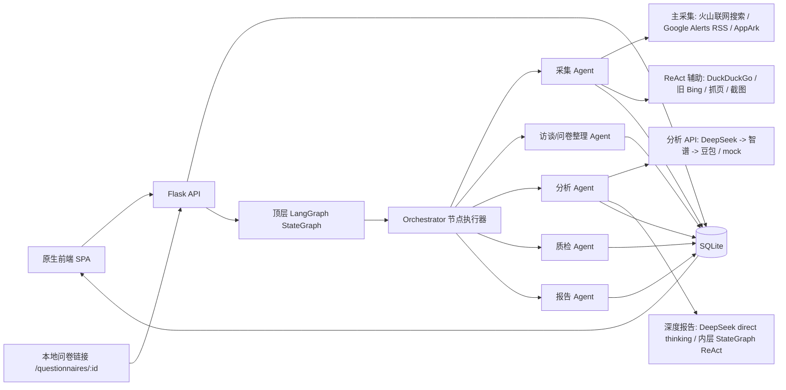

# MOSS多agent智能竞品分析系统——小莫架构说明

## 组件关系

## 数据流

1. 用户提交行业、竞品、官网或 URL、关注维度和数据来源模式。
2. Flask 写入 `tasks`、`competitors`，并启动顶层 LangGraph StateGraph；Orchestrator 作为节点执行器承载采集、分析、质检和报告的业务逻辑。
3. 实时采集模式下，采集 Agent 以火山联网搜索、Google Alerts RSS 和 AppArk 作为主采集来源，写入 `sources`、`evidence_chunks`、`collection_runs` 和 App 市场指标；失败则记录采集缺口，不混入无关缓存样例。
4. 上传材料由访谈/问卷整理 Agent 写入 evidence chunks，并生成带来源的结构化 claim。
5. 问卷设计由访谈/问卷整理 Agent 写入 `questionnaire_designs` 和 `sources`，并生成 `/questionnaires/<design_id>` 本地链接；问卷提交写入 `questionnaire_responses`。
6. 分析 Agent 先读取 evidence chunks，深度报告按 DeepSeek -> 智谱 -> 豆包顺序尝试已配置模型；DeepSeek direct thinking 优先，必要时使用内层 StateGraph ReAct 工具循环补证，结构化辅助能力未配置时降级到 `mock` Provider，随后映射到统一竞品 Schema。
7. 质检 Agent 自动质检最多三轮，校验来源覆盖、Schema 完整性、低置信度、时间敏感信息、重复结论和报告准入；同类问题三次仍失败时写入 `manual_pending` 并进入人工复核工作台，报告仍继续生成且标记 `needs_review`。
8. 报告 Agent 只渲染至少绑定一个 `source_id` 的结论，生成正式 `CompetitiveKnowledgeSchema` 覆盖功能树、定价模型、用户画像、SWOT、来源目录、方法论和图表数据；校验通过后写入 `reports` 和 `citation_map`。
9. 前端展示 LangGraph 流程阶段图、报告、来源、evidence、Trace，并支持日志筛选、调研助手和问卷链接复制。

## 核心表

- `tasks` / `competitors`：任务级隔离与竞品基础信息。
- `sources`：URL、上传文件、人工输入等来源。
- `evidence_chunks`：来源分片、位置、摘要、原文片段。
- `claims`：结构化结论、置信度、来源、生成 Agent。
- `qa_findings`：质检问题、严重级别、打回对象、修复状态。
- `agent_runs`：输入输出摘要、工具调用、Token、耗时、严重级别、重试、降级原因。
- `reports`：报告版本、引用映射、质检状态。
- `questionnaire_designs`：问卷标题、目标、结构化题目、关注维度和状态。
- `questionnaire_responses`：本地问卷回答、脱敏受访者标识和提交时间。
- `survey_analyses` / `interview_analyses`：问卷和访谈材料进入分析链路后的结构化发现。

## 安全默认值

- 不硬编码 API Key、Endpoint ID 或模型密钥。
- Flask 响应设置基础安全头与 CSP。
- SQLite 查询使用参数化 SQL。
- 上传文件限制大小为 25MB，扩展名仅允许 `.txt`、`.md`、`.csv`、`.json`、`.pdf`。
- 问卷页提示不要填写手机号、邮箱、身份证号、API Key 等敏感信息。
- 日志与下载包统一脱敏 API Key、Token、Cookie、Secret、邮箱和手机号。
